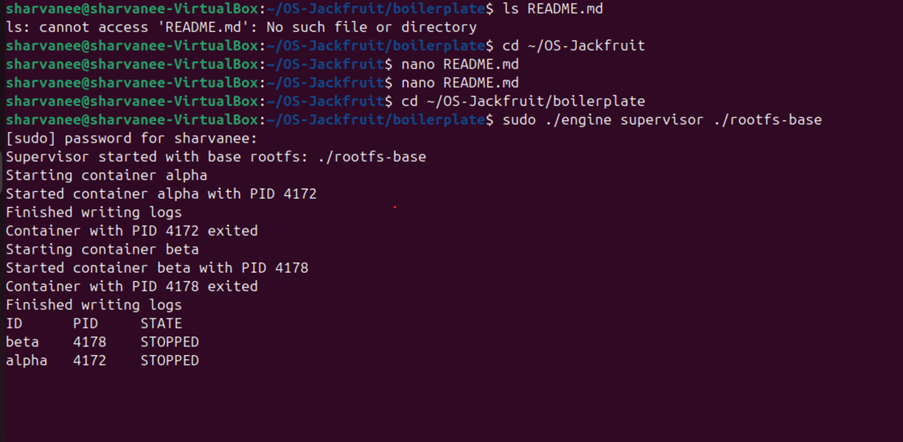
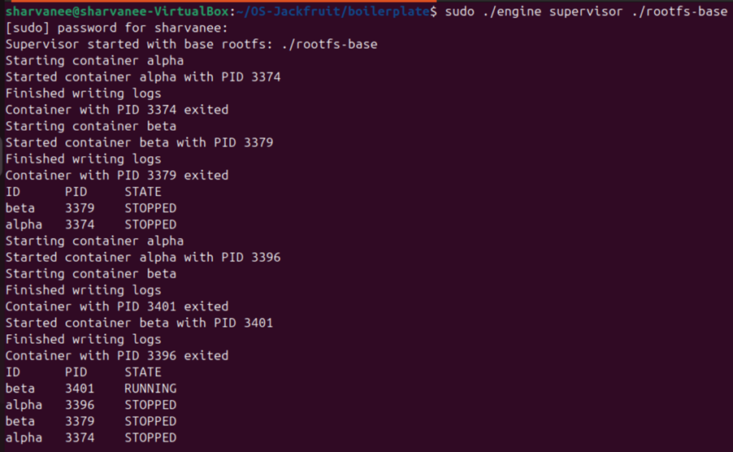
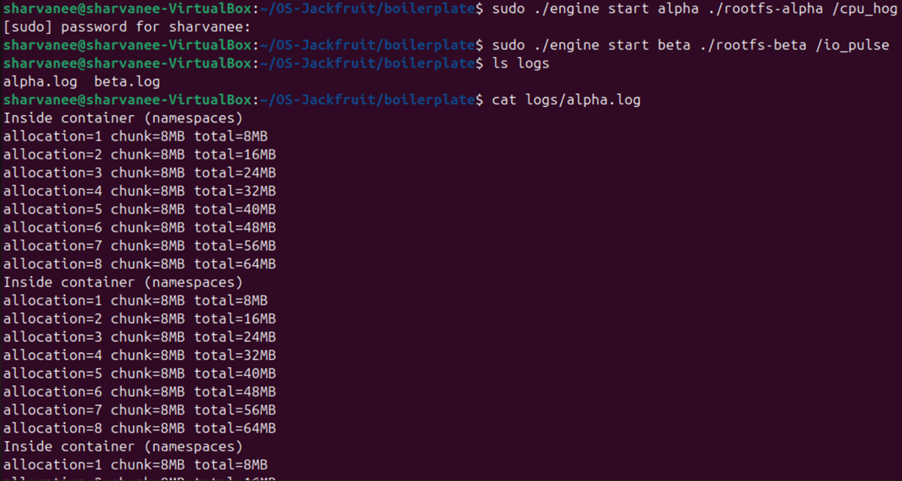
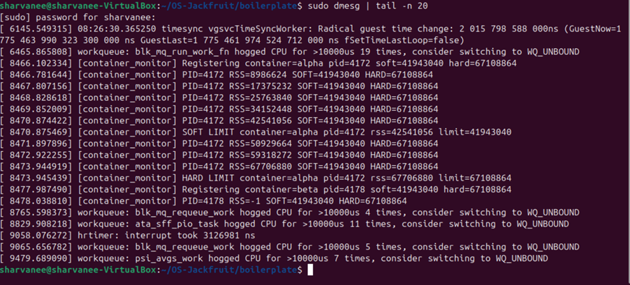
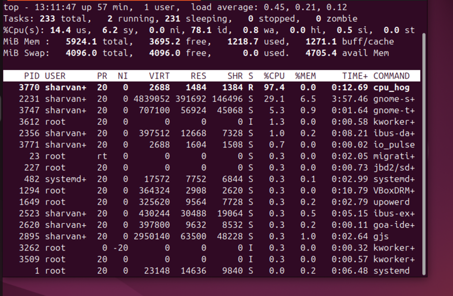
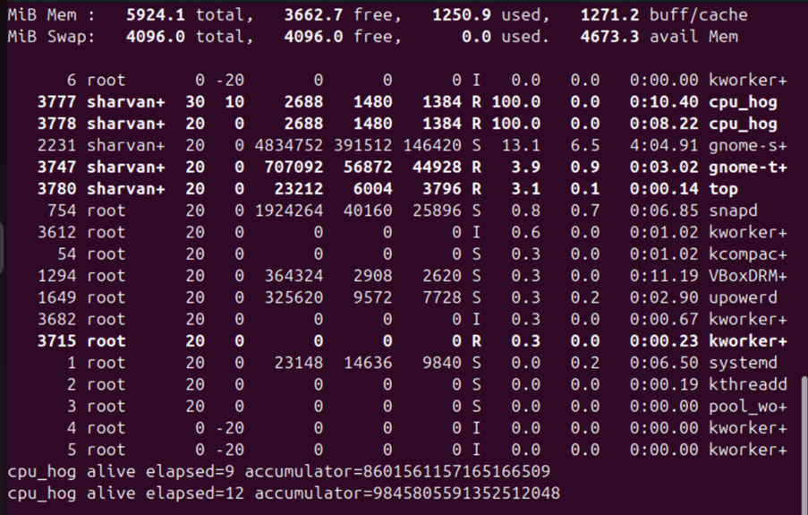
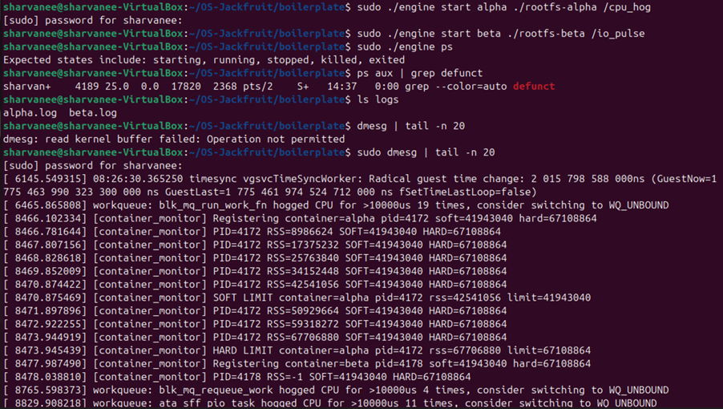

# Multi-Container Runtime

## Team Information

* Name: Sharvanee Naru 
* SRN: PES2UG24CS459
* Name: Sharanya C Bharadwaj
* SRN: PES2UG24CS458

---

## Overview

This project implements a lightweight Linux container runtime in C, featuring:

* Multi-container execution using namespaces
* A long-running supervisor process
* Per-container logging system
* Kernel-space memory monitor (LKM)
* Scheduling experiments using CPU and I/O workloads
* Proper lifecycle management and cleanup

---

## Build, Load, and Run Instructions

### 1. Build the Project

```bash
cd boilerplate
make
```

---

### 2. Load Kernel Module

```bash
sudo insmod monitor.ko
ls -l /dev/container_monitor
```

---

### 3. Start Supervisor

```bash
sudo ./engine supervisor ./rootfs-base
```

---

### 4. Prepare Containers

```bash
cp -a ./rootfs-base ./rootfs-alpha
cp -a ./rootfs-base ./rootfs-beta
```

---

### 5. Start Containers

```bash
sudo ./engine start alpha ./rootfs-alpha /cpu_hog
sudo ./engine start beta ./rootfs-beta /io_pulse
```

---

### 6. Inspect Containers

```bash
sudo ./engine ps
sudo ./engine logs alpha
```

---

### 7. Stop Containers and Cleanup

```bash
sudo ./engine stop alpha
sudo ./engine stop beta
sudo rmmod monitor
```

---

## Demo with Screenshots

### 1. Multi-Container Supervision



Shows the supervisor starting and managing multiple containers.

---

### 2. Metadata Tracking (CLI)



Displays container ID, PID, and state using the CLI.

---

### 3. Logging System (Bounded Buffer Pipeline)



Demonstrates per-container logs being generated and stored.

---

### 4. Kernel Monitoring (Memory Tracking)



Shows:

* Container registration
* RSS memory tracking
* Soft limit warnings
* Hard limit enforcement

---

### 5. Scheduling Experiment (CPU vs IO)



CPU-bound process consumes high CPU, while I/O-bound process uses minimal CPU.

---

### 6. Scheduling with Nice Values



Processes with lower nice values receive higher CPU priority.

---

### 7. Clean Teardown (No Zombies)



Confirms no zombie processes remain after execution.

---

## Engineering Analysis

### 1. Process Isolation

Containers are created using Linux namespaces, ensuring:

* Independent process trees
* Isolated filesystem views
* Separation of execution environments

---

### 2. Supervisor Role

The supervisor acts as:

* Central controller for container lifecycle
* Manager of process creation and termination
* Coordinator for logging and monitoring

---

### 3. Logging System

* Each container writes to its own log file
* Implements a producer-consumer style pipeline
* Ensures logs are persisted even after container exit

---

### 4. Kernel Monitoring

* Implemented as a Loadable Kernel Module (LKM)
* Tracks RSS memory usage per container
* Enforces:

  * Soft limits → warning
  * Hard limits → process termination

---

### 5. Scheduling Behavior

* CPU-bound processes utilize maximum CPU
* I/O-bound processes yield CPU frequently
* Nice values influence scheduling priority:

  * Lower nice → higher priority
  * Higher nice → lower priority

---

## **Design Decisions & Tradeoffs**

**Container Isolation**  
Design Choice: Namespace-based  
Tradeoff: Simpler implementation, but less secure than full containers  

**Supervisor**  
Design Choice: Single controller process  
Tradeoff: Easier to manage, but introduces a single point of failure  

**Logging**  
Design Choice: File-based logs  
Tradeoff: Simple to implement, but not highly scalable  

**Kernel Monitor**  
Design Choice: LKM-based tracking  
Tradeoff: Powerful monitoring, but increases system complexity  

**Scheduling Tests**  
Design Choice: Synthetic workloads  
Tradeoff: Easier to control and analyze, but less realistic behavior  


---

## Scheduler Experiment Results

### CPU vs IO

* CPU-bound (`cpu_hog`) uses ~100% CPU
* I/O-bound (`io_pulse`) uses minimal CPU

### Nice Values

* `nice -n 0` process gets higher CPU share
* `nice -n 10` process gets reduced CPU time

This demonstrates Linux’s fair scheduling and priority-based adjustments.

---

## Notes

* All screenshots were captured from the VM environment
* The system successfully demonstrates container runtime behavior, monitoring, and scheduling
* Additional experiments can be extended further if needed

---

## Conclusion

This project demonstrates a functional container runtime with:

* Process isolation
* Resource monitoring
* Logging pipeline
* Scheduling analysis

It provides practical insight into core operating system concepts including process management, memory control, and scheduling.
